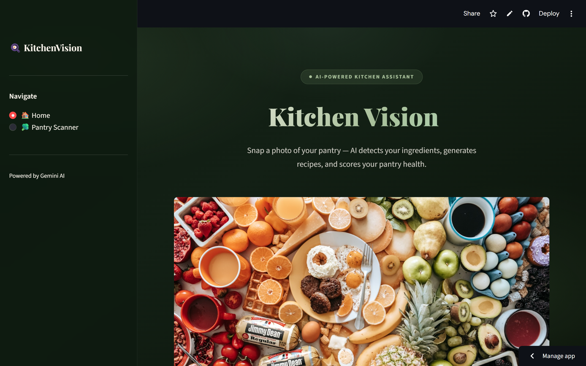
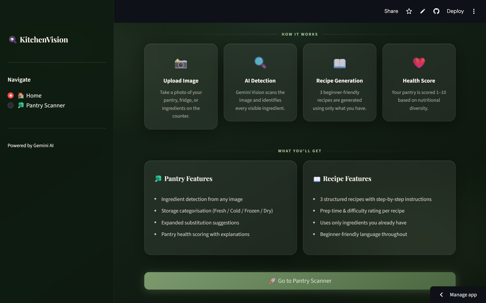
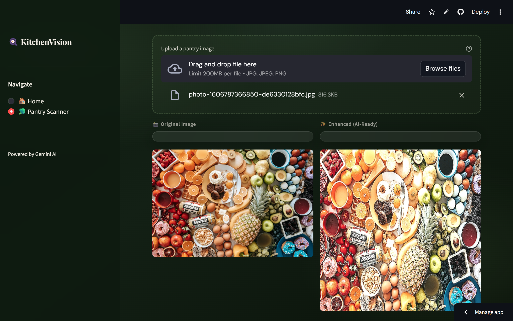
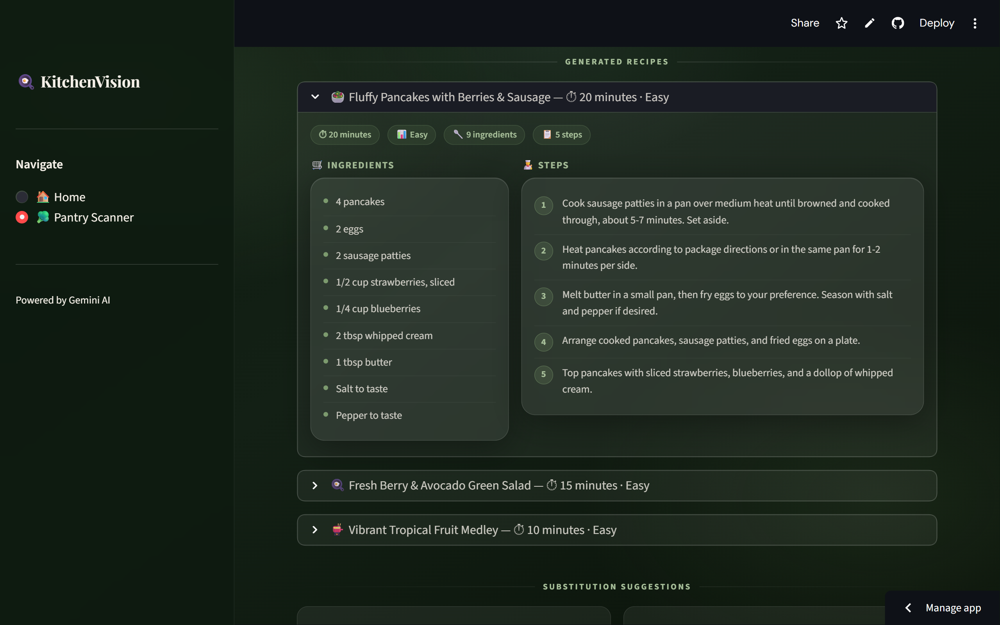
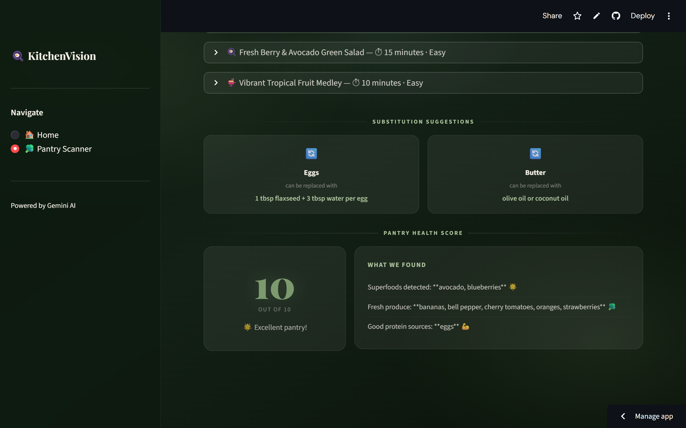

# 🍳 KitchenVision

> **AI-Powered Pantry Assistant** — Upload a photo of your fridge or pantry and instantly get ingredient detection, smart recipe suggestions, substitution recommendations, and a nutritional health score.

Built with **Streamlit** · **Gemini Vision API** · **OpenCV** · **Python 3.11**

---

## ✨ Features

| Feature | Description |
|---------|-------------|
| 🔍 **Ingredient Detection** | Upload any pantry or fridge photo — Gemini 2.5 Flash Vision identifies every visible ingredient |
| 🗂️ **Pantry Categorisation** | Automatically sorts ingredients into Fresh Produce, Cold Storage, Frozen, Proteins, and Dry Storage |
| 📖 **Recipe Generation** | Generates 3 beginner-friendly recipes using only what you have — with steps, prep time, and difficulty |
| 🔄 **Substitution Suggestions** | Recommends healthier or dietary-friendly alternatives for 23+ common ingredients |
| ❤️ **Health Score** | Scores your pantry 1–10 based on nutritional diversity — superfoods, proteins, fresh produce, and processed items |
| ✨ **Image Enhancement** | Preprocesses uploaded images with OpenCV for better AI detection accuracy |
| 💾 **Results Export** | Saves all outputs — ingredients, categories, recipes, substitutions, health score — to `outputs/results.json` |

---

## 📸 Screenshots

### Home Page



### Pantry Scanner


### Recipe Results


### Health Score


---

## 🛠️ Tech Stack

| Layer | Technology |
|-------|------------|
| Frontend | Streamlit 1.35+ |
| AI Vision | Gemini 2.5 Flash — ingredient detection from images |
| AI Text | Gemini 2.5 Flash — recipe generation |
| Image Processing | OpenCV 4.x, Pillow, NumPy |
| Styling | Custom CSS — glassmorphism dark green theme loaded from `assets/styles.css` |
| Fonts | Playfair Display, DM Sans, JetBrains Mono via Google Fonts |
| Environment | python-dotenv |
| Language | Python 3.11 |

---

## 📁 Project Structure

```
KitchenVision/
│
├── app.py                          ← Entry point — page config, CSS loader, sidebar nav, routing
├── requirements.txt                ← 6 essential dependencies
├── .env                            ← Your API key (never commit this)
├── .env.example                    ← API key template
│
├── assets/
│   └── styles.css                  ← All custom CSS — theme, glassmorphism components, responsive
│
├── services/
│   ├── __init__.py
│   ├── vision_service.py           ← Gemini 2.5 Flash vision detection → list[str]
│   ├── recipe_service.py           ← Gemini 2.5 Flash recipe generation → list[dict]
│   ├── substitution_service.py     ← Ingredient substitution lookup → dict[str, str]
│   └── health_service.py           ← Pantry health scoring → tuple[int, str]
│
├── utils/
│   ├── __init__.py
│   ├── logger.py                   ← Centralised logging (stdout, INFO level)
│   ├── image_utils.py              ← OpenCV preprocessing pipeline → uint8 ndarray
│   └── helpers.py                  ← Ingredient categorisation into 5 storage types
│
├── views/
│   ├── __init__.py
│   ├── home.py                     ← Landing page — hero, features, CTA
│   └── generator.py                ← Pantry Scanner — full detection and recipe pipeline
│
└── outputs/
    └── results.json                ← Auto-generated after each scan session
```

> **Why `views/` and not `pages/`?** Streamlit auto-discovers any folder named `pages/` and adds every file as a sidebar route. Using `views/` keeps our manual `st.radio` navigation in full control.

---

## ⚡ Quick Start

### 1. Clone the repository

```bash
git clone https://github.com/Madhusudan04337/KitchenVision.git
cd KitchenVision
```

### 2. Create and activate a virtual environment

```bash
# Windows
python -m venv venv
venv\Scripts\activate

# macOS / Linux
python3 -m venv venv
source venv/bin/activate
```

### 3. Install dependencies

```bash
pip install -r requirements.txt
```

### 4. Set up your API key

```bash
cp .env.example .env
```

Open `.env` and add your key:

```
GEMINI_API_KEY=your_actual_api_key_here
```

> Get a free Gemini API key at [Google AI Studio](https://aistudio.google.com/app/apikey)

### 5. Run the app

```bash
streamlit run app.py
```

Opens automatically at `http://localhost:8501`

---

## 🔑 Environment Variables

| Variable | Required | Description |
|----------|----------|-------------|
| `GEMINI_API_KEY` | ✅ Yes | Your Google Gemini API key from Google AI Studio |

Copy `.env.example` to `.env` — never commit your real `.env` file to git.

---

## 📦 Dependencies

```
streamlit>=1.35.0
google-generativeai>=0.8.0
Pillow>=10.0.0
numpy>=1.26.0
opencv-python>=4.8.0
python-dotenv>=1.0.0
```

---

## 🧑‍💻 How It Works

### Step 1 — Upload Image
Upload a JPG or PNG of your pantry or fridge. The image is preprocessed by `utils/image_utils.py` — resized to 512×512, contrast boosted (`alpha=1.2, beta=20`), and sharpened with a kernel — then returned as a `uint8` ndarray ready for the AI.

### Step 2 — Detect Ingredients
Clicking **Detect Ingredients** sends the PIL image to Gemini 2.5 Flash with a prompt requesting a comma-separated list. The response is parsed, lowercased, and stored in `st.session_state["ingredients"]`.

### Step 3 — Categorise
Detected ingredients are sorted into five storage categories by `utils/helpers.py` using keyword sets, with the priority order: **Frozen → Cold Storage → Fresh Produce → Proteins → Dry Storage**. Anything unmatched goes into Dry Storage.

### Step 4 — Generate Recipes
Clicking **Generate Recipes** sends the ingredient list to Gemini with a strict JSON prompt. The model returns 3 recipes. Markdown fences are stripped before `json.loads()`. Ingredient entries that come back as dicts are normalised to plain strings by `_normalise_ingredient()`.

### Step 5 — Substitutions and Health Score
Both run simultaneously. `suggest_substitutions()` matches against a 23-entry dictionary. `health_score()` uses set intersections across four ingredient groups to compute a score.

### Step 6 — Save Results
All outputs are saved to `outputs/results.json` via the `save_results()` callback in `app.py` — detected items, categories, all 3 recipes, substitutions, and the health score with explanation.

---

## 🗂️ Service Reference

### `services/vision_service.py`
- **Model:** `gemini-2.5-flash`
- **Input:** `PIL.Image`
- **Output:** `list[str]` — lowercase ingredient names
- **Error:** raises `RuntimeError` on API failure

### `services/recipe_service.py`
- **Model:** `gemini-2.5-flash`
- **Input:** `list[str]` — ingredient names
- **Output:** `list[dict]` — keys: `name`, `ingredients`, `steps`, `time`, `difficulty`
- **Note:** Strips markdown fences and normalises ingredient dicts to plain strings via `_normalise_ingredient()`

### `services/substitution_service.py`
- **Input:** `list[str]` — ingredient names
- **Output:** `dict[str, str]` — `{original: substitute}` for matched items only
- **Coverage:** 23 ingredients across dairy, eggs, sweeteners, flour, oils, proteins, and misc

### `services/health_service.py`
- **Input:** `list[str]` — ingredient names
- **Output:** `tuple[int, str]` — `(score, explanation)`
- **Formula:** `base 4 + fresh (max +3) + superfoods×2 (max +4) + proteins (max +2) − processed (max −3)`, clamped to `[1, 10]`

### `utils/image_utils.py`
- **Input:** `np.ndarray` RGB uint8
- **Output:** `np.ndarray` RGB uint8
- **Pipeline:** RGB→BGR → resize 512×512 → `convertScaleAbs(alpha=1.2, beta=20)` → sharpen kernel → `np.clip` → BGR→RGB
- **Note:** `filter2D` can produce float64 — explicit clip and `astype(uint8)` prevents blank image in Streamlit

---

## 🎨 Styling

All styles live in `assets/styles.css` and are loaded once at startup by `app.py`:

```python
def load_css(path: str):
    with open(path, "r") as f:
        st.markdown(f"<style>{f.read()}</style>", unsafe_allow_html=True)

load_css("assets/styles.css")
```

The theme uses a dark green glassmorphism design with CSS variables in `:root`. Swap the values to change the entire colour scheme instantly:

```css
:root {
    --sage:        #7C9A6E;   /* primary accent          */
    --sage-light:  #A8C09A;   /* lighter accent           */
    --bg-dark:     #0D1A0F;   /* app background base      */
    --bg-mid:      #132015;   /* app background mid-tone  */
    --glass-bg:    rgba(255,255,255,0.07);  /* card fill  */
    --glass-border:rgba(255,255,255,0.14);  /* card border */
}
```

To hide the Streamlit toolbar and Deploy button, create `.streamlit/config.toml`:

```toml
[client]
toolbarMode = "minimal"
```

---

## ⚠️ Common Issues

**`GEMINI_API_KEY is not set`**
You have not created your `.env` file. Run `cp .env.example .env` and add your key.

**`429 — Quota exceeded`**
The free Gemini tier has daily request limits. Wait until midnight Pacific time for the quota to reset, or use a different API key.

**`UnicodeDecodeError` on Windows when loading CSS**
Change the `load_css` function in `app.py` to open with explicit encoding:
```python
with open(path, "r", encoding="utf-8") as f:
```

**Ingredients display as raw dicts `{'item': '...', 'quantity': '...'}`**
This is a Gemini response quirk. `_normalise_ingredient()` in `recipe_service.py` handles it automatically — make sure you have the latest version of the file.

**Streamlit adds extra pages to the sidebar**
Your views folder is named `pages/` instead of `views/`. Rename it and update the imports in `app.py`.

**Session does not reset after uploading a new image**
The `on_change=_reset` callback on the file uploader in `generator.py` handles this. If state persists, check that `_reset()` clears all four keys: `ingredients`, `recipes`, `subs`, `health`.

---

## 🌿 Git Workflow

```
main  ←  develop  ←  member branches
```

| Branch | Member | Responsibility |
|--------|--------|----------------|
| `priyadarshini-ai-vision-api` | Priyadarshini | Vision service, logger |
| `lakshitha-backend-ai-logic` | Lakshitha | Helpers, substitutions, health score |
| `anandraj-recipe-engine` | Anand Raj | Recipe service, generator aggregation |
| `umaprasanna-streamlit-ui` | Uma Prasanna | app.py, image utils, home page, generator UI |
| `madhusudan-deployment-testing` | Madhusudan | Structure, testing, README, deployment |

### Commit convention

| Prefix | Usage |
|--------|-------|
| `feat(scope):` | New feature |
| `fix(scope):` | Bug fix |
| `chore:` | Setup, config, cleanup |
| `docs:` | Documentation only |
| `test:` | Tests |
| `perf:` | Performance improvement |

---

## 🤝 Team

| # | Name | Role | |
|---|------|------|---|
| 1 | Priyadarshini | AI Setup & Vision Integration | |
| 2 | Lakshitha | Backend AI Logic — Core Features | |
| 3 | Anand Raj | Recipe Engine & Aggregation | |
| 4 | Uma Prasanna | Streamlit UI & Interaction | |
| 5 | **Madhusudan** | Architecture, Deployment & Testing | **Team Lead** |

---

## 📄 License

This project was created for educational purposes as part of a team assignment.